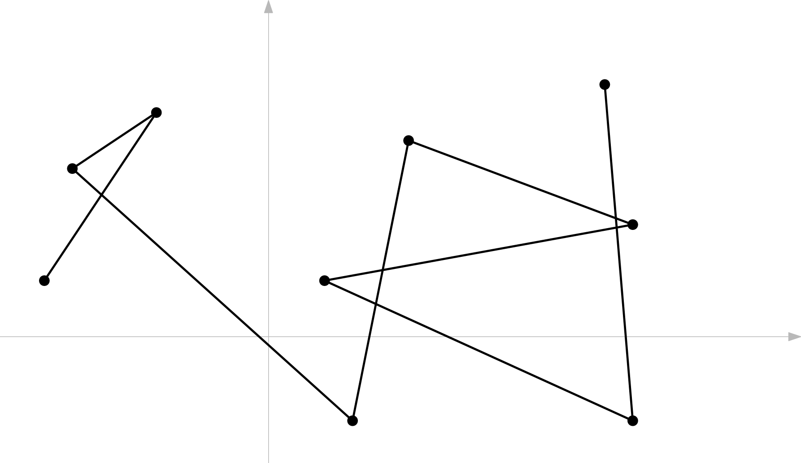

# Polygonal Curve

<figure><figcaption><p>A polygonal curve in the 2D Euclidean plane</p></figcaption></figure>

Most time series data are represented as _**polygonal curves**_, which are piecewise linear curves obtained by sequentially connecting data points in temporal order. Formally, given a sequence $$P = (p_1, p_2, \ldots, p_n)$$ where each $$p_i$$ is a point, the polygonal curve $$\mathcal{P}$$ is defined as the union of the line segments $$\overline{p_i p_{i+1}}$$ for $$1 \leq i < n$$. This representation transforms discrete time series into continuous geometric objects, enabling the use of geometric distance measures such as the Fréchet distance.

`PolygonalCurve` models a polygonal chain in the 2D Euclidean plane, that is, each point $$p_i\in \mathbb R^2$$, represented as an ordered sequence of _CGAL_ points (`Kernel::Point_2`). It provides basic operations such as length computation, coordinate transformations, and integer-grid projection. This class is a building block for higher-level algorithms such as [_Fréchet Distance_ (FD)](../algorithms/frechet-distance.md) and [_Geometric Edit Distance_ (GED)](../algorithms/geometric-edit-distance.md).


## Repository

[https://github.com/TOC-Lab-POSTECH/prior\_similarity\_curves](https://github.com/TOC-Lab-POSTECH/prior_similarity_curves)

***

## **Class Synopsis**

```cpp
class PolygonalCurve {
 public:
  PolygonalCurve(const std::vector<Point_2>& points);
  PolygonalCurve(const PolygonalCurve& P_);

  void addPoint(const Point_2& point);

  std::size_t numPoints() const;
  const Point_2& getPoint(std::size_t index) const;

  double curveLength() const;

  void printCurve() const;

  void shiftOrigin(const Point_2& newOrigin);
  void scaleGrid(double scalingFactor);
  void floorCoordinates();

 private:
  std::vector<Point_2> m_points;
};
```

***

## Dependencies

* **CGAL**
  * `Exact_predicates_inexact_constructions_kernel` (robust predicates, inexact constructions)
  * `Point_2` (2D point type)
* **STL**
  * `std::vector` for point storage
  * `std::out_of_range`, `std::invalid_argument` for error handling
  * `<cmath>` for `sqrt`, `floor`

***

## Design Notes

* **Order matters**
  * The points are stored in sequence to define the polyline.
* **Mutability**
  * Transformation functions (`shiftOrigin`, `scaleGrid`, `floorCoordinates`) mutate the curve in place.
* **Robustness**
  * Throws `std::out_of_range` on invalid indexing.
  * Throws `std::invalid_argument` if `scaleGrid` is called with factor `0`.
* **Empty curve**
  * `numPoints() == 0` is valid.
  * `curveLength()` returns `0.0` for curves with ≤1 point.

***

## Overall Structure



<table><thead><tr><th width="100">Name</th><th width="198">Type</th><th>Description</th></tr></thead><tbody><tr><td><a href="../api/#std-vector-less-than-point_2-greater-than-m_points"><code>m_point</code></a></td><td><code>std::vector&#x3C;Point_2></code></td><td>Ordered vertices of the polyline (may be empty). Access via public API only.</td></tr></tbody></table>



<table><thead><tr><th width="381">Name</th><th>Input</th><th>Complexity</th></tr></thead><tbody><tr><td><a href="../api/#polygonalcurve-const-std-vector-less-than-point_2-greater-than-and-points"><code>PolygonalCurve(const std::vector&#x3C;Point_2>&#x26; points)</code></a></td><td>vector of <span class="math">2D</span> points</td><td><span class="math">O(n)</span></td></tr><tr><td><a href="../api/#polygonalcurve-const-polygonalcurve-and-p"><code>PolygonalCurve(const PolygonalCurve&#x26; P_)</code></a></td><td>existing curve</td><td><span class="math">O(n)</span></td></tr></tbody></table>



<table><thead><tr><th width="441">Name</th><th width="135">Input</th><th width="131">Output</th><th>Complexity</th></tr></thead><tbody><tr><td><a href="../api/#void-addpoint-const-point_2-and-point"><code>void addPoint(const Point_2&#x26; point)</code></a></td><td>point</td><td>—</td><td>(Amortized) <span class="math">O(1)</span></td></tr><tr><td><a href="../api/#std-size_t-numpoints-const"><code>std::size_t numPoints() const</code></a></td><td>—</td><td>count</td><td><span class="math">O(1)</span></td></tr><tr><td><a href="../api/#const-point_2-and-getpoint-std-size_t-index-const"><code>const Point_2&#x26; getPoint(std::size_t index) const</code></a></td><td>index</td><td>const ref</td><td><span class="math">O(1)</span></td></tr><tr><td><a href="../api/#double-curvelength-const"><code>double curveLength() const</code></a></td><td>—</td><td>length</td><td><span class="math">O(n)</span></td></tr><tr><td><a href="../api/#void-printcurve-const"><code>void printCurve() const</code></a></td><td>—</td><td>—</td><td><span class="math">O(n)</span></td></tr><tr><td><a href="../api/#void-shiftorigin-const-point_2-and-neworigin"><code>void shiftOrigin(const Point_2&#x26; newOrigin)</code></a></td><td>origin point</td><td>—</td><td><span class="math">O(n)</span></td></tr><tr><td><a href="../api/#void-scalegrid-double-scalingfactor"><code>void scaleGrid(double scalingFactor)</code></a></td><td>nonzero scalar</td><td>—</td><td><span class="math">O(n)</span></td></tr><tr><td><a href="../api/#void-floorcoordinates"><code>void floorCoordinates()</code></a></td><td>—</td><td>—</td><td><span class="math">O(n)</span></td></tr></tbody></table>



***

## Example Usage

```cpp
#include <CGAL/Exact_predicates_inexact_constructions_kernel.h>
#include "polygonal_curve.h"
#include <vector>
#include <iostream>

using Kernel = CGAL::Exact_predicates_inexact_constructions_kernel;
using Point_2 = Kernel::Point_2;

int main() {
  // Create curve with 3 points
  PolygonalCurve curve({ {0.0, 0.0}, {2.0, 1.0}, {4.0, 2.0} });

  // Append new point
  curve.addPoint(Point_2(6.0, 1.0));

  std::cout << "Number of points: " << curve.numPoints() << "\n";
  std::cout << "Curve length: " << curve.curveLength() << "\n";

  // Apply transformations
  curve.shiftOrigin(Point_2(1.0, 1.0));
  curve.scaleGrid(2.0);
  curve.floorCoordinates();

  curve.printCurve(); // Debug print
}

```
